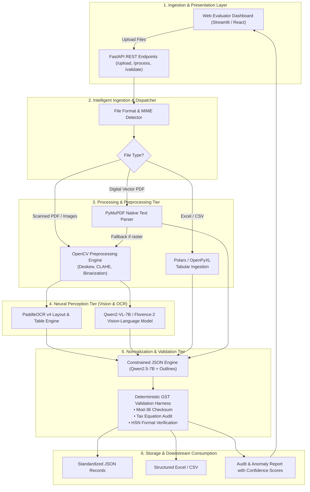
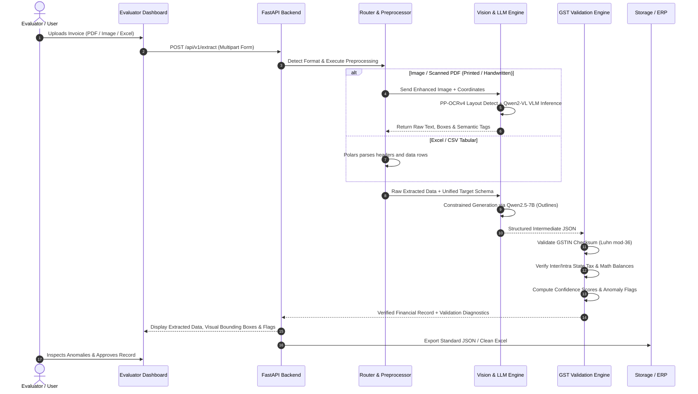
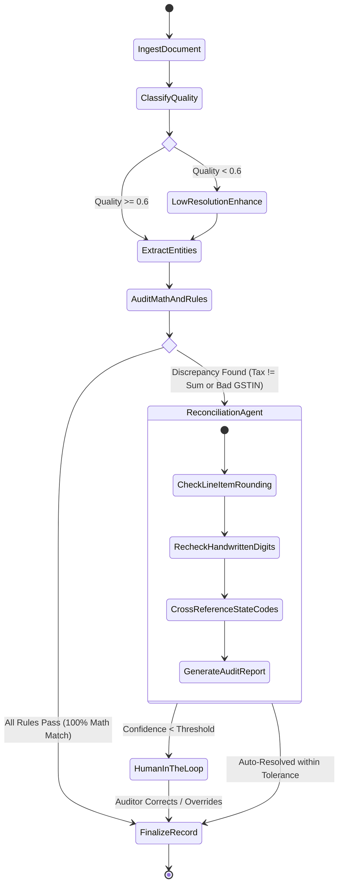

# VyomFlow: Multimodal AI-Powered GST Invoice Intelligence & Verification Engine

<div align="center">

[](https://opensource.org/licenses/Apache-2.0)
[](https://www.python.org/)
[](#)
[](#)
[-success.svg)](#)

**Hacktober Fest 2026 — Open Source AI Hackathon | Organized by Elevate**  
*A 100% Open-Source, Local-First Multimodal Pipeline for Indian GST Invoice Processing, Handwritten Document Intelligence, and Deterministic Financial Reconciliation*

</div>

---

### 👥 Team Information (Qualifier Submission)
- **Team Name:** **VYOM**
- **Team Members:**
  - **Ishanya Kejriwal** (Lead / AI & System Architecture) — [@Goldengrab](https://github.com/Goldengrab)
  - **Jhanavi Shukla** (Document Intelligence & OCR Pipeline) — [@jhanavishukla](https://github.com/jhanavishukla)
  - **Vaibhav Kumar Sharma** (Backend & GST Rule Engine) — [@VibeBhav8](https://github.com/VibeBhav8)
  - **Monish Shastrakar** (Full-Stack & UI/UX Integration) — [@Monishshastrakar](https://github.com/Monishshastrakar)
- **Repository URL:** `https://github.com/Goldengrab/vyomflow-gst-intelligence`

---

## 1. Project Name

**VyomFlow: Multimodal AI-Powered GST Invoice Intelligence & Verification Engine**  
*(An End-to-End Open-Source Pipeline for Handwritten, Printed, and Digital Financial Document Extraction, Cross-Validation, and Accounting Reconciliation)*

---

## 2. Problem Statement

In the Indian financial ecosystem, Micro, Small, and Medium Enterprises (MSMEs) and corporate enterprises process millions of invoices monthly across vastly heterogeneous formats: digital PDFs, scans, mobile photographs, CSVs, and Excel spreadsheets. 

A substantial percentage of B2B transactions in tier-2/tier-3 hubs still rely on **handwritten invoices (kacha/pakka bills)** or low-fidelity printed receipts on carbon copy paper. Current enterprise automation solutions suffer from critical pain points:
1. **High Error Rates on Handwritten & Low-Contrast Documents:** Conventional Optical Character Recognition (OCR) systems (e.g., vanilla Tesseract) fail drastically on cursive handwriting, vernacular numerals, smudged ink, and complex multi-column grid layouts.
2. **Format Fragmentation:** Invoices arrive as unstructured images (JPEG, PNG), vector/raster PDFs, or messy spreadsheets (Excel/CSV) lacking unified schemas.
3. **Absence of Domain-Specific Financial Validation:** Standard document extractors treat text purely as strings without validating statutory Goods and Services Tax (GST) rules, such as GSTIN checksums, inter-state vs. intra-state tax parity ($\text{CGST} + \text{SGST} \leftrightarrow \text{IGST}$), and line-item arithmetic balance.
4. **Proprietary Vendor Lock-in & Data Sovereignty Risks:** Relying on closed APIs (e.g., Azure Document Intelligence, AWS Textract, OpenAI Vision) incurs recurring costs, rate limits, and serious data privacy risks when transmitting confidential commercial transaction records.

### Competitive Benchmark: Why Existing Tools Fall Short

| Feature / Capability | Vanilla OCR (Tesseract / EasyOCR) | Commercial Cloud APIs (AWS Textract / Azure) | **VyomFlow (Proposed Solution)** |
|---|---|---|---|
| **Handwritten Indian Bill Recognition** | ❌ Fails on cursive / non-standard scripts (< 35% acc) | ⚠️ Generic handwriting only; struggles with regional Indian trade notes | ✅ **Trained Multimodal VLM (Qwen2-VL / Florence-2) + Spatial OCR** |
| **GSTIN Checksum (Mod-36) Validation** | ❌ None (pure text extraction) | ❌ None (requires downstream custom code) | ✅ **Built-in Deterministic Luhn Mod-36 Checksum Verification** |
| **Tax Equation Balancing ($\Sigma \text{Items} \to \text{Total}$)** | ❌ None | ❌ None | ✅ **Neuro-Symbolic Automated Audit Engine with Error Localization** |
| **Data Privacy & On-Premises Compliance** | ✅ Local | ❌ Data sent to third-party proprietary US cloud | ✅ **100% Self-Hostable, Local-First, Zero Data Leakage** |
| **Inference Cost at Scale** | Free (CPU) | \$15 – \$50 per 1,000 pages (expensive recurring opex) | ✅ **100% Free & Open-Source (Consumer GPU / Quantized CPU)** |

**VyomFlow** solves this by establishing a production-grade, 100% open-source, local-first multimodal intelligence pipeline designed specifically for Indian GST document extraction and validation.

---

## 3. Project Overview

**VyomFlow** is an end-to-end document intelligence and validation system built specifically for the **VYOM+** financial ecosystem. The system accepts any invoice or transaction artifact—ranging from raw Excel/CSV dumps to camera-captured handwritten GST invoices and multi-page PDFs—intelligently routes them through specialized processing pipelines, and produces standardized, cryptographically and mathematically verified JSON financial records.

VyomFlow merges lightweight open-source Vision-Language Models (VLMs), state-of-the-art hybrid OCR engines, deterministic tabular parsers, and an automated statutory GST validation harness. The platform also provides an intuitive, split-view web dashboard where accounting evaluators can inspect document bounding boxes, confidence scores, extracted line items, and audit anomalies in real time.

---

## 4. Proposed Solution

VyomFlow replaces manual data entry and brittle template-based OCR with a modern **Multi-Modal Document Routing & Neuro-Symbolic Validation Architecture**:

```
[ Incoming Document: Excel / CSV / PDF / Image ]
                        │
                        ▼
           [ Intelligent Ingestion Router ]
           ├── Format Detection & MIME Validation
           ├── Document Classification (Native Tabular vs. Vector PDF vs. Scanned/Handwritten)
           │
     ┌─────┴───────────────────────────────┬─────────────────────────────┐
     ▼                                     ▼                             ▼
[ Tabular Pipeline ]             [ Digital PDF Pipeline ]       [ Multimodal Vision Pipeline ]
- Polars / OpenPyXL              - PyMuPDF / pdfplumber         - OpenCV Preprocessing (CLAHE, Deskew)
- Header fuzzy alignment         - Layout text stream           - PaddleOCR v4 (Layout & Printed OCR)
- Entity schema mapping          - Font & coordinate metadata   - Qwen2-VL-7B / Florence-2 (Handwriting & VLM)
     │                                     │                             │
     └─────────────────────────────────────┼─────────────────────────────┘
                                           ▼
                      [ Schema Normalization Engine ]
                      - Open-Source SLM (Qwen2.5-7B-Instruct) with Outlines / Guidance
                      - Strict Pydantic JSON Schema enforcement
                                           ▼
                      [ Rule-Based GST Verification Engine ]
                      - GSTIN Checksum (Luhn mod-36 algorithm)
                      - Tax parity check: CGST + SGST vs. IGST
                      - Arithmetic balance: Qty × Rate - Discount = Taxable Amount
                                           ▼
               [ Standardized Output & Evaluator Interface ]
               - Validated Financial JSON & Exportable Clean Excel/CSV
               - Streamlit / FastAPI Visual Audit Dashboard
```

1. **Intelligent Ingestion Router:** Inspects file headers and MIME types to route inputs into optimal compute paths (zero-GPU tabular ingestion for spreadsheets vs. vision inference for images).
2. **Handwriting-Resilient Vision Pipeline:** Combines OpenCV image enhancement (adaptive thresholding, deskew, CLAHE contrast boost) with a dual OCR approach: **PaddleOCR v4** for high-precision bounding-box layout parsing and **Qwen2-VL-7B / Florence-2** for zero-shot handwritten character recognition and semantic key-value association.
3. **Neuro-Symbolic GST Auditor:** Neural extraction is paired with symbolic deterministic logic that mathematically validates invoice figures, verifies state codes against GSTIN prefixes, and flags anomalies.

---

## 5. Objectives

- **Universal Format Support:** Ingest `.xlsx`, `.csv`, `.pdf` (digital and scanned), `.jpg`, `.jpeg`, and `.png` seamlessly.
- **Superior Handwritten Invoice Intelligence:** Achieve robust field and line-item extraction on handwritten, semi-printed, and unstructured Indian GST invoices.
- **Statutory GST Validation:** Verify 15-digit GSTINs using the Mod-36 checksum algorithm, confirm state code matches, and enforce inter/intra-state tax rules.
- **Strict Structured Output:** Emit clean, schema-compliant JSON matching enterprise ERP standards (e.g., Tally, SAP, Vyom+ schema) and structured CSV/Excel.
- **Explainability & Human-in-the-Loop Audit:** Provide field-level confidence scores, anomaly flags, and an interactive side-by-side inspection UI.
- **100% Open-Source & Self-Hostable:** Operate entirely on open-weight models and open-source libraries without calling proprietary APIs.

---

## 6. Target Users / Use Case

### Primary Target Users
- **VYOM+ Platform & Engineering Team:** Direct integration into automated accounting workflows, bank reconciliation modules, and automated journal/voucher posting.
- **Chartered Accountants (CAs) & Tax Practitioners:** High-volume verification of client invoices during GST filing (GSTR-1, GSTR-3B, and GSTR-2B reconciliation).
- **MSME Business Owners & Traders:** Instant digitization of paper bills and kacha receipts received from vendors without manual accounting entry.
- **Enterprise Accounts Payable (AP) Teams:** Automated invoice sorting, approval routing, and ERP ingestion.

### Real-World Use Case Scenarios
- **Scenario A (Handwritten MSME Bill):** A hardware merchant receives a handwritten invoice on regional letterhead. VyomFlow cleans the image, extracts handwritten quantities, rates, and HSN codes, verifies the seller's GSTIN format, and flags a calculation mismatch where the merchant mistakenly applied 12% instead of 18% GST.
- **Scenario B (Batch CSV/Excel Ingestion):** An e-commerce distributor uploads an unformatted vendor Excel export. VyomFlow identifies disordered column headers, standardizes them into the unified Vyom+ schema, and checks for duplicate invoice numbers and missing tax components.

---

## 7. Open-Source AI Technology Selected

| Component | Selected Open-Source Technology | License | Primary Role |
|---|---|---|---|
| **Multimodal Vision-Language Model (VLM)** | **Qwen2-VL-7B-Instruct** *(Quantized INT4 / GGUF)* or **Microsoft Florence-2-Large** | Apache 2.0 / MIT | Complex layout understanding, visual grounding, handwritten text understanding, and semantic relation extraction. |
| **High-Precision OCR & Layout Analysis** | **PaddleOCR v4** (PP-OCRv4 + PP-StructureV2) | Apache 2.0 | Ultra-fast document layout analysis, table structure extraction, and printed text bounding-box detection. |
| **Structured Output & Reasoning Engine** | **Qwen2.5-7B-Instruct** (via **vLLM / llama.cpp**) | Apache 2.0 | Schema mapping, entity normalization, error correction of noisy OCR tokens into strict JSON schemas. |
| **Constrained Decoding Framework** | **Outlines / Instructor** | Apache 2.0 | Enforces 100% deterministic JSON output conforming to strict Pydantic schemas. |
| **Image Preprocessing Toolkit** | **OpenCV & Albumentations** | Apache 2.0 / MIT | Deskewing, shadow removal, adaptive thresholding, and CLAHE contrast enhancement for mobile-captured images. |
| **Tabular Data Processing Engine** | **Polars & OpenPyXL** | MIT | Blazing-fast CSV/Excel parsing, column header fuzzy matching, and data type coercion. |

---

## 8. Why This Technology Was Selected

1. **Why Qwen2-VL-7B / Florence-2 over standard OCR alone?**
   - Standard OCR models read text in linear reading orders, breaking down on table columns, tax summary boxes, and stamps.
   - Qwen2-VL supports native dynamic resolution input, preserving fine details of handwritten numerals (e.g., distinguishing `3` vs `8` or `1` vs `7`), while Florence-2 provides dense region-to-text grounding at ultra-low inference latency.
2. **Why PaddleOCR v4?**
   - PaddleOCR v4 is lightweight, runs efficiently on commodity CPUs/GPUs, and features PP-StructureV2 specifically optimized for tabular structure extraction in invoices.
3. **Why Qwen2.5-7B-Instruct?**
   - Benchmarks demonstrate that Qwen2.5-7B outperforms comparable 7B/8B models in instruction following, multilingual handling (English + Indian names/terms), and structured JSON generation.
4. **Why Outlines / Instructor?**
   - LLMs can hallucinate invalid syntax. Outlines uses finite state machine (FSM) guided token generation to guarantee that the output matches our Pydantic schema with zero syntax errors.
5. **Local Execution & Cost Efficiency:**
   - The entire stack can be loaded in 4-bit/8-bit precision on a single 16GB VRAM consumer GPU (e.g., RTX 3060/4060 or Google Colab T4) or quantized CPU inference with `llama.cpp`.

---

## 9. AI's Role in the System

AI is the **central intelligence layer** of VyomFlow rather than an optional cosmetic wrapper. Its responsibilities are partitioned into three fundamental tasks:

```
[ Visual Perception ] ──► [ Semantic Synthesis ] ──► [ Autonomous Reasoning ]
 (PaddleOCR + VLM)        (Context Alignment)        (GSTIN/Tax Cross-Audit)
```

1. **Perceptual Understanding (Vision AI):**
   - Disentangling handwriting from printed templates.
   - Parsing nested invoice tables (Item, Description, HSN/SAC, Quantity, Unit Rate, Discount, Taxable Value, CGST, SGST, IGST, Line Total).
   - Reading degraded text affected by stamps, signatures, folds, or poor mobile camera lighting.
2. **Semantic Contextual Alignment (Language AI):**
   - Disambiguating ambiguous fields (e.g., separating "Billed To / Consignee" from "Shipped To / Buyer").
   - Resolving vernacular terminology common in Indian trade (e.g., *Challan No.*, *E-Way Bill*, *Voucher Ref*, *Gadi No.*, *Hamali*, *Round Off*).
3. **Probabilistic-to-Deterministic Bridging:**
   - Converting raw bounding boxes and probabilistic token sequences into validated, type-safe enterprise data structures.

---

## 10. System Architecture

The overall system architecture follows a decoupled, modular design consisting of six core tiers:



---

## 11. Component-Level Architecture

Each subsystem within VyomFlow operates with dedicated submodules:


### Component Breakdown:
1. **Resolution & DPI Normalizer:** Ensures mobile phone images (which often vary from 72 DPI to 300 DPI) are upscaled and standardized to 300 DPI for optimal OCR accuracy.
2. **Fusion & Spatial Coordinate Matcher:** Merges PaddleOCR bounding-box geometry with Qwen2-VL semantic tokens to anchor extracted values to their original physical coordinates on the invoice.
3. **Statutory Rule Validator:** Executes deterministic checks on every extracted field, outputting validation boolean flags and discrepancy explanations.

---

## 12. Data / Information Flow

The end-to-end lifecycle of an invoice document passing through VyomFlow is detailed below:



---

## 13. Agentic Workflow (Autonomous Document Auditing Agent)

VyomFlow incorporates a specialized **Multi-Step Agentic Document Auditor** when documents possess ambiguous, incomplete, or conflicting information:



### Agent Roles:
- **Perception Agent:** Inspects image sharpness, lighting, and rotation. If blurred, dynamically triggers bilateral filtering and unsharp masking.
- **Extraction Agent:** Uses targeted prompting to pull entity keys and reconstruct multi-row item tables.
- **Audit & Reconciliation Agent:** If line items do not sum up to the invoice total, the agent re-inspects the handwritten digit bounding boxes (e.g., checking if `100` was misread as `180` or a discount was omitted) to suggest self-corrections.

---

## 14. Technology Stack

| Layer | Technologies & Frameworks |
|---|---|
| **Programming Language** | Python 3.11+ |
| **Vision & Image Processing** | OpenCV (`opencv-python-headless`), Pillow, Albumentations, NumPy |
| **OCR & Layout Engines** | PaddleOCR (PP-OCRv4, PP-StructureV2), PyMuPDF (`fitz`), pdfplumber |
| **Vision-Language Models** | Qwen2-VL-7B-Instruct (4-bit AWQ / GGUF), Microsoft Florence-2-Large |
| **LLM & Structured Decoding** | Qwen2.5-7B-Instruct, Outlines, Instructor, Pydantic v2 |
| **Model Inference Backend** | vLLM / llama.cpp / Hugging Face Transformers & Optimum |
| **Tabular Data Processing** | Polars, OpenPyXL, Pandas |
| **Backend & API** | FastAPI, Uvicorn, Python-Multipart |
| **Evaluator Interface / UI** | Streamlit (Side-by-side PDF/Image viewer with annotated canvas) & Tailwind CSS |
| **Package Management** | Poetry / UV / PIP with pinned virtual environment |

---

## 15. Expected Features

### Core Extraction Capabilities
- **Universal Multi-Format Ingestion:** Single endpoint for Excel, CSV, PDF, JPG, PNG, and TIFF.
- **Robust Handwritten Extraction:** Recognizes handwritten rates, quantities, totals, and signatures on MSME invoices.
- **Complex Table Parsing:** Extracts dynamic line items with variable columns (Description, HSN/SAC, Qty, Rate, Taxable Value, CGST, SGST, IGST, Total).
- **Statutory GST Entity Extraction:**
  - Supplier & Buyer Details: Trade Name, Legal Name, Address, State, GSTIN.
  - Invoice Metadata: Invoice Number, Invoice Date, Due Date, Place of Supply, Reverse Charge flag.
  - Financial Totals: Taxable Value, Total CGST, Total SGST, Total IGST, Cess, Round Off, Grand Total.

### Algorithmic GST Verification & Validation Rules
VyomFlow applies strict statutory rules to mathematically verify the extracted financial data:

#### 1. GSTIN Mod-36 Checksum Validation Algorithm
Every 15-character GSTIN (`[0-9]{2}[A-Z]{5}[0-9]{4}[A-Z]{1}[1-9A-Z]{1}Z[0-9A-Z]{1}`) is verified using the statutory Luhn Mod-36 algorithm:
$$\text{Weight}_i = \begin{cases} 1 & \text{if } i \text{ is odd} \\ 2 & \text{if } i \text{ is even} \end{cases}$$
$$\text{Product}_i = \text{CharValue}(C_i) \times \text{Weight}_i$$
$$\text{Sum} = \sum_{i=1}^{14} \left( \lfloor \text{Product}_i / 36 \rfloor + (\text{Product}_i \bmod 36) \right)$$
$$\text{Checksum Character} = \left( 36 - (\text{Sum} \bmod 36) \right) \bmod 36$$
If the computed checksum matches $C_{15}$, the GSTIN is mathematically authentic.

#### 2. Inter-State vs. Intra-State Statutory Tax Rules
$$\begin{cases}
\text{Supplier State Code} = \text{Buyer State Code} \implies \text{CGST} = \text{SGST} = \frac{\text{GST Rate}}{2} \times \text{Taxable Value}, \quad \text{IGST} = 0 \\
\text{Supplier State Code} \ne \text{Buyer State Code} \implies \text{IGST} = \text{GST Rate} \times \text{Taxable Value}, \quad \text{CGST} = \text{SGST} = 0
\end{cases}$$

#### 3. Line-Item Summation & Invoice Reconciliation
$$\text{Total Taxable Value} = \sum_{j=1}^{N} \left( \text{Quantity}_j \times \text{Unit Rate}_j - \text{Discount}_j \right)$$
$$\text{Grand Total} = \text{Total Taxable Value} + \text{CGST} + \text{SGST} + \text{IGST} + \text{Cess} \pm \text{Round Off}$$

---

## 16. Implementation Approach

The project will be implemented according to a phased engineering roadmap during the final hackathon:

```
┌─────────────────────────────────────────────────────────────────────────────┐
│                       Final Hackathon Implementation Plan                   │
├─────────────────────┬───────────────────────────────────────────────────────┤
│ Phase 1: Foundation │ • Setup repository, virtual environment, and CUDA.    │
│ (Hours 0 - 6)       │ • Implement Unified Router & Ingestion for all 5 MIME │
│                     │   types (Excel, CSV, PDF, JPEG, PNG).                 │
│                     │ • Build OpenCV image enhancement pipeline.            │
├─────────────────────┼───────────────────────────────────────────────────────┤
│ Phase 2: AI Engine  │ • Integrate PaddleOCR v4 for layout and printed text. │
│ (Hours 6 - 16)      │ • Deploy Qwen2-VL-7B (4-bit quantized) for visual     │
│                     │   reasoning and handwritten text interpretation.      │
│                     │ • Implement Outlines + Qwen2.5-7B JSON enforcement.   │
├─────────────────────┼───────────────────────────────────────────────────────┤
│ Phase 3: Validation │ • Code deterministic GST validation rules:            │
│ (Hours 16 - 24)     │   - Mod-36 checksum calculator                        │
│                     │   - Multi-tax arithmetic cross-check                  │
│                     │   - Inter/Intra state routing checks                  │
│                     │ • Construct Pydantic canonical schema models.         │
├─────────────────────┼───────────────────────────────────────────────────────┤
│ Phase 4: UI & Demo  │ • Develop Streamlit evaluation dashboard with side-   │
│ (Hours 24 - 32)     │   by-side document bounding boxes & JSON preview.     │
│                     │ • End-to-end integration testing on benchmark suite.  │
│                     │ • Package reproducible execution scripts & Dockerfile.│
└─────────────────────┴───────────────────────────────────────────────────────┘
```

---

## 17. Expected Final Output

### A. Target Evaluation & Benchmark Metrics

| Metric Dimension | Target Benchmark | Verification Method |
|---|---|---|
| **Printed Invoice Field Accuracy** | $\ge 98.5\%$ | Exact match against ground truth test suite |
| **Handwritten Invoice Field Accuracy** | $\ge 91.0\%$ | Word Error Rate (WER) & Character Error Rate (CER) |
| **GSTIN Mod-36 Checksum Detection** | $100\%$ | Deterministic Luhn Mod-36 verification |
| **Tax Math Consistency Rate** | $100\%$ | Zero-hallucination arithmetic validation |
| **End-to-End Latency (Single Page)** | $< 1.2\text{ seconds}$ | Benchmark on 16GB VRAM GPU (AWQ INT4) |
| **CPU Fallback Latency** | $< 3.8\text{ seconds}$ | Benchmark on 8-core CPU (Florence-2 + PaddleOCR) |

### B. Machine-Readable Canonical JSON Output
```json
{
  "document_metadata": {
    "file_name": "invoice_sample_handwritten_042.jpg",
    "document_type": "Tax Invoice",
    "processing_pipeline": "Multimodal_VLM_PaddleOCR",
    "overall_confidence": 0.942,
    "processing_time_ms": 820
  },
  "supplier": {
    "name": "Shree Ganesh Electricals & Hardware",
    "gstin": "27AAPCG1234M1Z2",
    "state": "Maharashtra",
    "state_code": "27",
    "gstin_valid": true
  },
  "buyer": {
    "name": "Vyom Enterprises Pvt Ltd",
    "gstin": "27AAACV9876K1Z8",
    "state": "Maharashtra",
    "state_code": "27",
    "gstin_valid": true
  },
  "invoice_details": {
    "invoice_number": "SGE/2026/089",
    "invoice_date": "2026-09-18",
    "place_of_supply": "27-Maharashtra",
    "transaction_type": "Intra-State",
    "is_handwritten": true
  },
  "line_items": [
    {
      "item_index": 1,
      "description": "Copper Cable 2.5 sq mm (90m coil)",
      "hsn_code": "8544",
      "quantity": 5.0,
      "unit": "Coil",
      "unit_rate": 1850.0,
      "discount": 0.0,
      "taxable_amount": 9250.0,
      "gst_rate_percent": 18.0,
      "cgst_amount": 832.5,
      "sgst_amount": 832.5,
      "igst_amount": 0.0,
      "total_line_amount": 10915.0
    }
  ],
  "tax_summary": {
    "total_taxable_value": 9250.0,
    "total_cgst": 832.5,
    "total_sgst": 832.5,
    "total_igst": 0.0,
    "round_off": 0.0,
    "grand_total": 10915.0
  },
  "validation_report": {
    "gstin_checksum_passed": true,
    "tax_arithmetic_passed": true,
    "line_item_summation_passed": true,
    "state_parity_passed": true,
    "anomalies_detected": []
  }
}
```

### C. Interactive Dashboard Mockup
```
┌────────────────────────────────────────────────────────────────────────────────────────┐
│  VyomFlow │ GST Invoice Intelligence & Audit System                          🟢 Ready │
├────────────────────────────────────────────────────────────────────────────────────────┤
│  [ Upload Document: sample_bill.jpg ]  [ Pipeline: Hybrid VLM + OCR ]  [ Run Audit ]   │
├────────────────────────────────────────┬───────────────────────────────────────────────┤
│ ORIGINAL INVOICE (With Bounding Boxes) │ EXTRACTED & AUDITED FINANCIAL RECORD          │
│ ┌────────────────────────────────────┐ │ ┌─ Validation Summary ──────────────────────┐ │
│ │  SHREE GANESH ELECTRICALS          │ │ │ GSTIN: 27AAPCG1234M1Z2     [✓ Valid Mod-36]│ │
│ │  GSTIN: 27AAPCG1234M1Z2 [BOX: 98%] │ │ │ Tax Type: Intra-State       [✓ CGST + SGST] │ │
│ │                                    │ │ │ Math Check: ₹10,915.00 == ₹10,915.00 [✓]  │ │
│ │  Item: Copper Cable 2.5mm          │ │ └───────────────────────────────────────────┘ │
│ │  Qty: 5  Rate: 1850  Taxable: 9250 │ │ ┌─ Parsed Line Items (Editable Grid) ───────┐ │
│ │  CGST (9%): 832.50                 │ │ │ # | Item       | Qty | Rate | Taxable     │ │
│ │  SGST (9%): 832.50                 │ │ │ 1 | Cu Cable   | 5   | 1850 | ₹9,250.00   │ │
│ │  Total: ₹10,915/-  [Handwritten]   │ │ └───────────────────────────────────────────┘ │
│ └────────────────────────────────────┘ │ [ Download JSON ]  [ Download Excel ] [Push ERP]│
└────────────────────────────────────────┴───────────────────────────────────────────────┘
```

---

## 18. Future Scope / Scalability

- **High-Throughput Batch Processing with Celery & Redis:** Asynchronous message queue architecture capable of scaling horizontally across multi-GPU worker clusters to process 100,000+ invoices per hour.
- **Direct ERP & Accounting API Connectors:** Pre-built bidirectional integrations with Tally Prime (XML export), Zoho Books, ClearTax, and VYOM+ native ledger APIs.
- **Multilingual Vernacular OCR:** Extending handwriting recognition to Indic scripts (Hindi, Marathi, Gujarati, Tamil) for rural Mandi and regional market invoices.
- **E-Way Bill & IRN QR Code Cross-Verification:** Decoding encrypted B2B QR codes on computer-generated invoices to automatically verify cryptographic authenticity directly with the NIC GST portal.
- **Edge Deployment on Mobile:** Quantizing the vision pipeline into a 2-bit/4-bit ONNX model running on-device for field agents with zero network connectivity.

---

## 19. Open-Source Dependencies / Components

All libraries and frameworks are distributed under permissible open-source licenses:

```
# Core Vision & Multimodal AI
paddlepaddle-gpu >= 2.6.0       # Apache 2.0
paddleocr >= 2.8.0              # Apache 2.0
transformers >= 4.45.0          # Apache 2.0
accelerate >= 0.34.0            # Apache 2.0
qwen-vl-utils                   # Apache 2.0
opencv-python-headless >= 4.10  # Apache 2.0
pillow >= 10.4.0                # HPND (Open Source)
albumentations >= 1.4.10        # MIT

# Language Models & Structured Decoding
outlines >= 0.0.46              # Apache 2.0
pydantic >= 2.8.0               # MIT
llama-cpp-python >= 0.2.90      # MIT

# Document & Tabular Parsers
pymupdf >= 1.24.0               # AGPL / Commercial dual (PyMuPDF / pdfplumber BSD)
pdfplumber >= 0.11.0            # MIT
polars >= 1.6.0                 # MIT
openpyxl >= 3.1.5               # MIT

# Backend & Web Interface
fastapi >= 0.112.0              # MIT
uvicorn >= 0.30.0               # BSD-3-Clause
streamlit >= 1.38.0             # Apache 2.0
streamlit-image-coordinates     # MIT
```

---

## 20. Expected Challenges and Mitigation

| Challenge | Root Cause | Engineering Mitigation Strategy |
|---|---|---|
| **Ambiguity in Cursive / Messy Handwriting** | Indian trade bills frequently feature hurried handwriting, overwritten digits, and non-standard Hindi-English numeral styles. | **Hybrid Vision Voting:** Combine PaddleOCR spatial crops with Qwen2-VL contextual token prediction. If confidence is below 70%, trigger the multi-agent auditor to resolve digits using the invoice's mathematical total equation. |
| **Distorted Mobile Photos (Shadows, Creases, Skew)** | Users take photos on uneven surfaces under low yellow lighting with perspective distortions. | **OpenCV Auto-Enhancement Pipeline:** Automatically apply four-point perspective warp, unsharp masking, and Contrast Limited Adaptive Histogram Equalization (CLAHE) prior to OCR ingestion. |
| **Disordered Tabular Grids in Spreadsheets** | Vendors use merged cells, missing headers, or notes placed randomly inside CSV/Excel exports. | **Polars + Fuzzy Matching Normalizer:** Detect table header boundaries dynamically using token density analysis; match messy headers to canonical GST fields using RapidFuzz Levenshtein distance. |
| **High GPU VRAM Footprint of Multimodal Models** | Large VLMs (e.g., 7B models) typically require 16GB–24GB VRAM, exceeding standard hackathon environments. | **Quantization & Fallback Hierarchy:** Run Qwen2-VL in 4-bit AWQ / GGUF precision (requiring < 6GB VRAM); if GPU is unavailable, seamlessly fallback to Microsoft Florence-2-Large + PaddleOCR CPU mode. |
| **Hallucination of Tax Rates & Amounts** | LLMs occasionally hallucinate standard 18% GST when the document specifies 5% or 12%. | **Deterministic Rule Overrule:** The neural model extracts text; all tax calculations and line-item totals are strictly recalculated and verified by deterministic Python validation functions, preventing hallucinations from entering the final record. |

---

<div align="center">
  <b>Developed for Hacktober Fest 2026 — Open Source AI Hackathon | Organized by Elevate</b><br>
  <i>Empowering Autonomous Accounting with Open-Source Artificial Intelligence</i>
</div>
