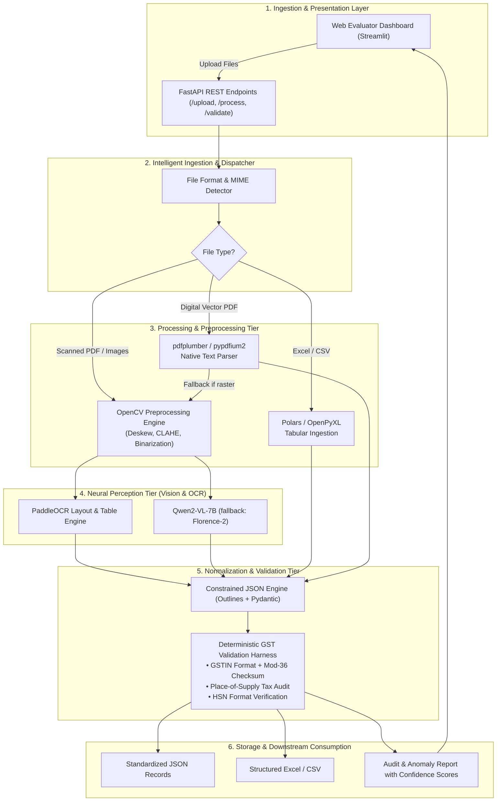
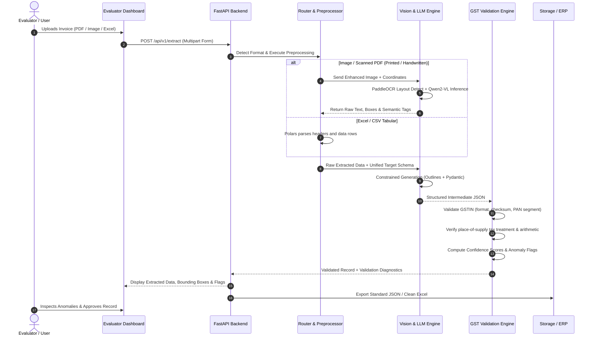
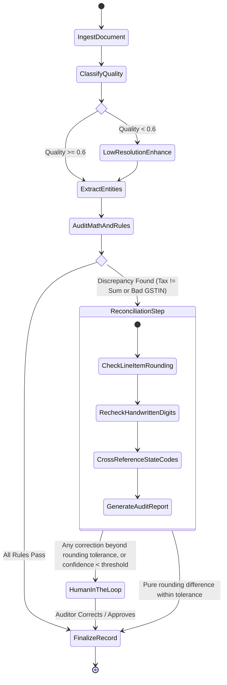

# VyomFlow: Multimodal AI-Powered GST Invoice Intelligence & Verification Engine

[](https://opensource.org/licenses/Apache-2.0)
[](https://www.python.org/)
[](#)
[](#)
[-success.svg)](#)

**Hacktober Fest 2026 — Open Source AI Hackathon | Organized by Elevate**  
*A local-first, open-weight multimodal pipeline for Indian GST invoice processing, handwritten document intelligence, and deterministic financial validation.*

> **Status:** This repository currently contains the technical proposal only. All performance figures in this document are **design targets, not measured results**. Sample data in this README is illustrative.

---

### 👥 Team Information (Qualifier Submission)

- **Team Name:** **VYOM**
- **Team Members:**
  * **Ishanya Kejriwal** (Lead / AI & System Architecture) — [@Goldengrab](https://github.com/Goldengrab)
  * **Jhanavi Shukla** (Document Intelligence & OCR Pipeline) — [@jhanavishukla](https://github.com/jhanavishukla)
  * **Vaibhav Kumar Sharma** (Backend & GST Rule Engine) — [@VibeBhav8](https://github.com/VibeBhav8)
  * **Monish Shastrakar** (Full-Stack & UI/UX Integration) — [@Monishshastrakar](https://github.com/Monishshastrakar)
- **Repository URL:** `https://github.com/Goldengrab/vyomflow-gst-intelligence`

---

## 1. Project Name

**VyomFlow: Multimodal AI-Powered GST Invoice Intelligence & Verification Engine**  
*(An open-source pipeline for handwritten, printed, and digital financial document extraction, cross-validation, and accounting reconciliation)*

---

## 2. Problem Statement

In the Indian financial ecosystem, Micro, Small, and Medium Enterprises (MSMEs) and larger enterprises process very large volumes of invoices across heterogeneous formats: digital PDFs, scans, mobile photographs, CSVs, and Excel spreadsheets.

A substantial share of B2B transactions in tier-2/tier-3 trading hubs still relies on **handwritten invoices (kacha/pakka bills)** or low-fidelity printed receipts on carbon-copy paper. Current automation suffers from these pain points:

1. **High error rates on handwritten and low-contrast documents:** General-purpose OCR engines tend to struggle with cursive handwriting, vernacular numerals, smudged ink, and complex multi-column grid layouts.
2. **Format fragmentation:** Invoices arrive as images (JPEG, PNG), digital or scanned PDFs, or messy spreadsheets (Excel/CSV) without a unified schema.
3. **No domain-specific financial validation:** Generic extractors treat text as strings and do not validate statutory GST rules such as GSTIN checksums, inter-state vs. intra-state tax treatment (CGST + SGST ↔ IGST), and line-item arithmetic.
4. **Vendor lock-in and data-sovereignty concerns:** Closed cloud APIs (e.g., Azure Document Intelligence, AWS Textract, OpenAI Vision) carry recurring per-page costs, rate limits, and require sending confidential commercial records to a third-party service.

### Competitive Comparison

| Feature / Capability | Vanilla OCR (Tesseract / EasyOCR) | Commercial Cloud APIs (AWS Textract / Azure) | **VyomFlow (Proposed)** |
|---|---|---|---|
| **Handwritten Indian bill recognition** | ⚠️ Typically weak on cursive and regional handwriting (to be benchmarked) | ⚠️ General handwriting support; regional trade notes not a focus | ✅ **VLM-based reading (Qwen2-VL, zero-shot) + spatial OCR** — accuracy to be measured |
| **GSTIN checksum (Luhn mod-36) validation** | ❌ None | ❌ None (requires custom downstream code) | ✅ **Deterministic checksum verification** |
| **Tax equation balancing (Σ items → total)** | ❌ None | ❌ None | ✅ **Rule-based audit engine with error localization** |
| **Data privacy** | ✅ Local | ⚠️ Data processed by a third-party vendor (India regions are available, but processing is still external) | ✅ **Self-hostable, local-first; no external API calls** |
| **Inference cost at scale** | Free (CPU) | Per-page pricing (roughly $10–$50 per 1,000 pages depending on API/features; verify current rates) | ✅ **No per-page fees** (hardware and operations costs only) |

**VyomFlow** aims to provide an open-source, local-first multimodal pipeline designed specifically for Indian GST document extraction and validation.

---

## 3. Project Overview

**VyomFlow** is an end-to-end document intelligence and validation system built for the **VYOM+** financial ecosystem. It accepts invoice or transaction artifacts — from raw Excel/CSV exports to camera-captured handwritten GST invoices and multi-page PDFs — routes them through specialized processing pipelines, and produces standardized JSON records that have passed deterministic arithmetic and format checks.

VyomFlow combines open-weight Vision-Language Models (VLMs), an open-source OCR/layout engine, deterministic tabular parsers, and a rule-based GST validation harness. A split-view web dashboard lets accounting reviewers inspect bounding boxes, confidence scores, extracted line items, and audit anomalies.

---

## 4. Proposed Solution

VyomFlow replaces manual data entry and brittle template-based OCR with a **Multi-Modal Document Routing & Neuro-Symbolic Validation Architecture**:

```
[ Incoming Document: Excel / CSV / PDF / Image ]
                        │
                        ▼
           [ Intelligent Ingestion Router ]
           ├── Format Detection & MIME Validation
           ├── Document Classification (Native Tabular vs. Digital PDF vs. Scanned/Handwritten)
           │
     ┌─────┴───────────────────────────────┬─────────────────────────────┐
     ▼                                     ▼                             ▼
[ Tabular Pipeline ]             [ Digital PDF Pipeline ]       [ Multimodal Vision Pipeline ]
- Polars / OpenPyXL              - pdfplumber / pypdfium2       - OpenCV Preprocessing (CLAHE, Deskew)
- Header fuzzy alignment         - Layout text stream           - PaddleOCR (Layout & Printed OCR)
- Entity schema mapping          - Font & coordinate metadata   - Qwen2-VL-7B (Handwriting & VLM)
     │                                     │                             │
     └─────────────────────────────────────┼─────────────────────────────┘
                                           ▼
                      [ Schema Normalization Engine ]
                      - Open-weight LLM/VLM with Outlines (constrained decoding)
                      - Strict Pydantic JSON schema enforcement
                                           ▼
                      [ Rule-Based GST Verification Engine ]
                      - GSTIN format + checksum (Luhn mod-36) + PAN-segment check
                      - Tax treatment check by place of supply
                      - Arithmetic balance: Qty × Rate − Discount = Taxable Amount
                                           ▼
               [ Standardized Output & Evaluator Interface ]
               - Validated JSON & exportable clean Excel/CSV
               - Streamlit + FastAPI visual audit dashboard
```

1. **Intelligent Ingestion Router:** Inspects file headers and MIME types to route inputs to the cheapest suitable path (CPU-only tabular ingestion for spreadsheets vs. vision inference for images).
2. **Handwriting-Oriented Vision Pipeline:** Combines OpenCV enhancement (adaptive thresholding, deskew, CLAHE) with two readers: **PaddleOCR** for bounding-box layout parsing and printed text, and **Qwen2-VL-7B** (zero-shot) for handwritten text and key-value association. **Florence-2-Large** is a lower-accuracy fallback for CPU-only or low-VRAM environments.
3. **Neuro-Symbolic GST Auditor:** Neural extraction is paired with deterministic logic that validates invoice figures, checks state codes against GSTIN prefixes, and flags anomalies. Models never perform the final tax arithmetic.

---

## 5. Objectives

- **Universal format support:** Ingest `.xlsx`, `.csv`, `.pdf` (digital and scanned), `.jpg`, `.jpeg`, `.png`, and `.tiff`.
- **Handwritten invoice extraction:** Aim for robust field and line-item extraction on handwritten, semi-printed, and unstructured Indian GST invoices (accuracy targets in Section 17).
- **Statutory GST validation:** Verify 15-character GSTINs (format, mod-36 checksum, state code, embedded PAN structure) and check tax treatment by place of supply.
- **Strict structured output:** Emit schema-compliant JSON suitable for ERP integration (e.g., Tally, VYOM+ schema) and structured CSV/Excel.
- **Explainability & human-in-the-loop audit:** Field-level confidence scores, anomaly flags, and a side-by-side inspection UI.
- **Open-weight and self-hostable:** Operate on open-weight models and open-source libraries without calling proprietary APIs.

---

## 6. Target Users / Use Case

### Primary Target Users

- **VYOM+ platform & engineering team:** Integration into accounting workflows, bank reconciliation, and automated voucher posting.
- **Chartered Accountants (CAs) & tax practitioners:** High-volume verification of client invoices during GST filing (GSTR-1, GSTR-3B, and GSTR-2B reconciliation).
- **MSME owners & traders:** Digitizing paper bills and kacha receipts from vendors without manual entry.
- **Enterprise Accounts Payable (AP) teams:** Automated invoice sorting, approval routing, and ERP ingestion.

### Real-World Use Case Scenarios

- **Scenario A (Handwritten MSME bill):** A hardware merchant receives a handwritten invoice on regional letterhead. VyomFlow cleans the image, extracts quantities, rates, and HSN codes, checks the seller's GSTIN format and checksum, and flags that the merchant applied a legacy **12%** rate on an invoice dated after the **22 September 2025** rate restructuring (the 12% slab was removed; most goods now fall under 5% or 18%).
- **Scenario B (Batch CSV/Excel ingestion):** An e-commerce distributor uploads an unformatted vendor Excel export. VyomFlow identifies disordered column headers, maps them to the unified VYOM+ schema, and checks for duplicate invoice numbers and missing tax components.

---

## 7. Open-Source AI Technology Selected

| Component | Selected Technology | License | Primary Role |
|---|---|---|---|
| **Vision-Language Model (primary)** | **Qwen2-VL-7B-Instruct** (4-bit AWQ; GGUF to be evaluated) | Apache 2.0 | Layout understanding, handwritten text reading, key-value extraction (zero-shot) |
| **Vision-Language Model (lightweight fallback)** | **Microsoft Florence-2-Large** | MIT | Printed-text OCR and region grounding on low-VRAM/CPU setups; not expected to match Qwen2-VL on handwriting |
| **OCR & layout analysis** | **PaddleOCR** (PP-OCRv4 + PP-StructureV2; evaluate PP-OCRv5 / PP-StructureV3 in PaddleOCR 3.x) | Apache 2.0 | Layout analysis, table structure extraction, printed-text bounding boxes |
| **Structured output engine** | **Qwen2.5-7B-Instruct** (via vLLM or llama.cpp), *optional* — see note | Apache 2.0 | Schema mapping and normalization of noisy OCR tokens into the JSON schema |
| **Constrained decoding** | **Outlines** | Apache 2.0 | Guarantees syntactically valid output conforming to a Pydantic schema |
| **Image preprocessing** | **OpenCV & Albumentations** | Apache 2.0 / MIT | Deskew, shadow removal, adaptive thresholding, CLAHE |
| **Tabular processing** | **Polars, OpenPyXL, RapidFuzz** | MIT | Fast CSV/Excel parsing, header fuzzy matching, type coercion |

> **Design note:** Running two separate 7B models (Qwen2-VL and Qwen2.5) raises VRAM use and latency. The normalization step with Qwen2.5-7B is used for text-only inputs (OCR text, spreadsheets). For image inputs we will benchmark letting Qwen2-VL emit the schema directly with constrained decoding and keep whichever approach has the better accuracy/latency trade-off.

---

## 8. Why This Technology Was Selected

1. **Why a VLM (Qwen2-VL-7B) alongside OCR?**
   - Standard OCR reads text in linear order and tends to break down on table columns, tax summary boxes, and stamps.
   - Qwen2-VL supports dynamic-resolution input, which helps preserve detail of handwritten numerals (e.g., `3` vs `8`, `1` vs `7`). It is used **zero-shot**; no fine-tuning is currently planned.
   - Florence-2 is a much smaller model that is useful as a fallback for printed text and region grounding, but it is not a substitute for a larger VLM on handwriting or key-value extraction.
2. **Why PaddleOCR?**
   - It is lightweight, runs on commodity CPUs/GPUs, and includes structure-analysis modules for table extraction. Newer PaddleOCR 3.x releases will be evaluated before pinning versions. Language-model coverage (e.g., Devanagari) must be checked per release.
3. **Why Qwen2.5-7B-Instruct?**
   - Strong instruction following and structured-JSON generation for its size, with multilingual coverage; Apache 2.0 licensed.
4. **Why Outlines?**
   - Constrained (finite-state-machine guided) decoding guarantees the output is **syntactically valid and schema-conformant**. It does not guarantee the *values* are correct — that is the job of the validation engine and human review.
5. **Local execution & cost:**
   - With 4-bit quantization the stack is designed to fit on a single GPU with **16 GB VRAM** (e.g., Google Colab T4, RTX 4060 Ti 16 GB). A 12 GB card (e.g., RTX 3060 12 GB) may work with a single model loaded at a time. 8 GB cards are expected to require the CPU/Florence-2 fallback. Actual memory use depends on image resolution and context length and will be measured.

---

## 9. AI's Role in the System

AI is the **perception and semantic layer**; deterministic code is the **authority on financial correctness**.

```
[ Visual Perception ] ──► [ Semantic Synthesis ] ──► [ Deterministic Validation ]
 (PaddleOCR + VLM)        (Context Alignment)         (GSTIN / Tax Rule Engine)
```

1. **Perceptual understanding (Vision AI):**
   - Separating handwriting from printed templates.
   - Parsing invoice tables (Item, Description, HSN/SAC, Quantity, Unit Rate, Discount, Taxable Value, CGST, SGST, IGST, Line Total).
   - Reading degraded text affected by stamps, signatures, folds, or poor lighting.
2. **Semantic contextual alignment (Language AI):**
   - Disambiguating fields (e.g., "Billed To / Consignee" vs. "Shipped To / Buyer").
   - Interpreting vernacular trade terminology (e.g., *Challan No.*, *E-Way Bill*, *Voucher Ref*, *Gadi No.*, *Hamali*, *Round Off*).
3. **Probabilistic-to-deterministic bridging:**
   - Converting raw bounding boxes and token sequences into typed, schema-validated records that the rule engine can check.

---

## 10. System Architecture

The system follows a decoupled, modular design with six tiers:



---

## 11. Component-Level Architecture


### Component Breakdown

1. **Resolution & DPI Normalizer:** Mobile images vary widely in effective resolution; this step rescales to a target resolution for OCR (upscaling cannot recover detail that was never captured, so very low-quality inputs are flagged rather than silently "fixed").
2. **Fusion & Spatial Coordinate Matcher:** Merges PaddleOCR bounding-box geometry with VLM-extracted values to anchor each value to its location on the invoice. *This is the highest-risk integration component and will be prototyped early.*
3. **Statutory Rule Validator:** Executes deterministic checks on every extracted field and outputs validation flags with discrepancy explanations.

---

## 12. Data / Information Flow



---

## 13. Agentic Workflow (Bounded, Rule-Driven Audit Loop)

When a document has ambiguous, incomplete, or conflicting information, VyomFlow runs a **bounded audit loop**: a deterministic state machine that calls models for specific sub-tasks (re-reading a region, re-checking digits). It is deliberately limited and always ends in either a validated record or a human review.



### Step Roles

- **Perception step:** Checks image sharpness, lighting, and rotation. If blurred, applies bilateral filtering and unsharp masking.
- **Extraction step:** Uses targeted prompting to pull entity keys and reconstruct multi-row item tables.
- **Audit & reconciliation step:** If line items do not sum to the invoice total, re-inspects the handwritten digit regions (e.g., checking whether `100` was misread as `180`) and **proposes** a correction. Because back-solving digits from totals can bias results toward numbers that merely fit, proposed digit corrections are **never applied silently**: they are shown as suggestions with confidence scores and require reviewer approval. Only pure rounding differences within a configured tolerance are auto-resolved.

---

## 14. Technology Stack

| Layer | Technologies & Frameworks |
|---|---|
| **Programming language** | Python 3.11+ |
| **Vision & image processing** | OpenCV (`opencv-python-headless`), Pillow, Albumentations, NumPy |
| **OCR & layout** | PaddleOCR (PP-OCRv4 / PP-StructureV2; evaluating 3.x), pdfplumber, pypdfium2 |
| **Vision-language models** | Qwen2-VL-7B-Instruct (4-bit AWQ; GGUF under evaluation), Microsoft Florence-2-Large (fallback) |
| **LLM & structured decoding** | Qwen2.5-7B-Instruct (optional), Outlines, Pydantic v2 |
| **Model inference backend** | vLLM (Linux) / llama.cpp / Hugging Face Transformers & Optimum |
| **Tabular data** | Polars, OpenPyXL, Pandas, RapidFuzz |
| **Backend & API** | FastAPI, Uvicorn, python-multipart |
| **Evaluator interface** | Streamlit with `streamlit-image-coordinates` for the annotated side-by-side viewer |
| **Package management** | uv or Poetry with a pinned lockfile |

> **Environment note:** PaddlePaddle and PyTorch ship with their own CUDA/cuDNN requirements, and combining them in one environment can cause version conflicts. Plan to isolate them (separate virtual environments or containers) if conflicts appear.

---

## 15. Expected Features

### Core Extraction Capabilities

- **Multi-format ingestion:** Single endpoint for Excel, CSV, PDF, JPG, PNG, and TIFF.
- **Handwritten extraction (best effort):** Reads handwritten rates, quantities, and totals on MSME invoices, with per-field confidence.
- **Complex table parsing:** Extracts line items with variable columns (Description, HSN/SAC, Qty, Rate, Taxable Value, CGST, SGST, IGST, Total).
- **GST entity extraction:**
  * Supplier & buyer details: Trade name, legal name, address, state, GSTIN.
  * Invoice metadata: Invoice number, date, due date, place of supply, reverse-charge flag.
  * Financial totals: Taxable value, total CGST, SGST, IGST, cess, round-off, grand total.

### Algorithmic GST Verification & Validation Rules

VyomFlow applies deterministic rules to the extracted data. These rules detect **format and consistency problems**; they do not prove that a taxpayer is registered or that an invoice is genuine.

#### 1. GSTIN validation

A GSTIN is a **15-character alphanumeric** identifier with this structure:

```
[0-9]{2}[A-Z]{5}[0-9]{4}[A-Z]{1}[1-9A-Z]{1}Z[0-9A-Z]{1}
 state   PAN (chars 3-12)   entity  Z  check
```

Checks performed:

1. **Format** against the pattern above.
2. **State code** (chars 1–2) is a valid GST state/UT code and matches the stated state.
3. **Embedded PAN** (chars 3–12) has valid PAN structure (5 letters, 4 digits, 1 letter; 4th letter indicates entity type).
4. **Checksum (Luhn mod-36 variant).** Using the character set `0-9A-Z` (values 0–35), for positions `i = 0 … 13` (zero-based):

$$w_i = \begin{cases} 1 & i \text{ even} \\ 2 & i \text{ odd} \end{cases} \qquad p_i = v(c_i)\cdot w_i$$

$$S = \sum_{i=0}^{13} \left( \left\lfloor \frac{p_i}{36} \right\rfloor + (p_i \bmod 36) \right)$$

$$\text{check} = (36 - (S \bmod 36)) \bmod 36$$

The GSTIN passes if the character with value `check` equals the 15th character.

> A valid checksum only rules out typographical errors. Confirming that a GSTIN is **registered and active** requires the GSTN portal or an authorized API and is out of scope for the offline engine (listed under Future Scope).

#### 2. Tax treatment (CGST + SGST vs. IGST)

Whether a supply is intra-state or inter-state is determined by the **place of supply** and the **location of the supplier** under the GST law — not simply by the buyer's registered state. For typical B2B goods, the place of supply is the delivery location, which can differ from the buyer's registered address (bill-to vs. ship-to).

$$\begin{cases}
\text{Supplier location} = \text{Place of supply} \implies \text{CGST} = \text{SGST} = \tfrac{r}{2}\times\text{Taxable}, \ \text{IGST}=0 \\
\text{Supplier location} \ne \text{Place of supply} \implies \text{IGST} = r\times\text{Taxable}, \ \text{CGST}=\text{SGST}=0
\end{cases}$$

where `r` is the applicable GST rate. The rule engine additionally handles or flags:

- **Union Territories without a legislature**, which levy **UTGST** in place of SGST.
- **SEZ supplies, exports, and reverse-charge** invoices (flagged for review rather than auto-judged).
- **Composition-scheme dealers**, who cannot charge GST on invoices.
- **Cess**, where applicable.

#### 3. Rate checks use a date-effective rate table

GST rates change over time. For example, the 12% and 28% slabs were removed effective **22 September 2025** (leaving 5% and 18%, plus a 40% slab for specified sin/luxury goods). The engine therefore looks up the expected rate by **HSN/SAC code and invoice date** from a versioned rate table, rather than hard-coding rates. Invoices dated before a rate change are validated against the old rates. Rate mismatches are reported as **warnings for review**, since classification disputes are legitimate.

#### 4. Line-item summation & invoice reconciliation

$$\text{Total Taxable Value} = \sum_{j=1}^{N}\left(\text{Qty}_j \times \text{Rate}_j - \text{Discount}_j\right)$$

$$\text{Grand Total} = \text{Total Taxable Value} + \text{CGST} + \text{SGST} + \text{IGST} + \text{Cess} \pm \text{Round Off}$$

Comparisons use a configurable tolerance (default ₹1.00 at invoice level) to accommodate per-line vs. per-invoice rounding.

---

## 16. Implementation Approach

The project will be implemented in a phased roadmap during the final hackathon. Items are tiered so that a working, demonstrable core exists early.

```
┌─────────────────────────────────────────────────────────────────────────────┐
│                       Final Hackathon Implementation Plan                   │
├─────────────────────┬───────────────────────────────────────────────────────┤
│ Phase 1: Foundation │ MUST: Repo, environment, CUDA setup.                  │
│ (Hours 0 - 6)       │ MUST: Router + ingestion for Excel/CSV/PDF/JPEG/PNG.  │
│                     │ MUST: GSTIN validator + tax/arithmetic rule engine    │
│                     │       with unit tests (no model required).            │
├─────────────────────┼───────────────────────────────────────────────────────┤
│ Phase 2: AI Engine  │ MUST: PaddleOCR integration (layout + printed text).  │
│ (Hours 6 - 18)      │ MUST: Qwen2-VL (4-bit) extraction with Outlines.      │
│                     │ SHOULD: OpenCV enhancement pipeline.                  │
│                     │ STRETCH: Fusion/coordinate matcher, Florence-2        │
│                     │          fallback, separate Qwen2.5 normalizer.       │
├─────────────────────┼───────────────────────────────────────────────────────┤
│ Phase 3: Validation │ MUST: Pydantic canonical schema + diagnostics.        │
│ (Hours 18 - 25)     │ SHOULD: PAN-segment check, date-effective rate table. │
│                     │ STRETCH: Confidence scoring, audit loop.              │
├─────────────────────┼───────────────────────────────────────────────────────┤
│ Phase 4: UI & Demo  │ MUST: Streamlit dashboard with JSON + flags.          │
│ (Hours 25 - 32)     │ SHOULD: Side-by-side bounding-box overlay.            │
│                     │ MUST: Integration tests on a small sample set,        │
│                     │       reproducible run script, Dockerfile.            │
└─────────────────────┴───────────────────────────────────────────────────────┘
```

---

## 17. Expected Final Output

### A. Target Evaluation & Benchmark Metrics

> **All values below are design targets that have not yet been measured.** The test set will be assembled from synthetic and sample invoices; its size and composition will be documented with the first results.

| Metric | Target | Verification Method |
|---|---|---|
| **Printed invoice field accuracy** | ≥ 98.5% *(stretch target)* | Exact-match field accuracy against labeled test set |
| **Handwritten invoice field accuracy** | ≥ 91.0% *(stretch target)* | Field-level exact match; CER reported separately for text fields |
| **GSTIN validator correctness** | 100% on unit-test suite | Known-valid and known-invalid GSTIN test vectors |
| **Arithmetic error detection** | 100% of injected errors on synthetic set | Programmatically corrupted invoices |
| **End-to-end latency (single page, GPU)** | ≤ 15 s *(to be benchmarked)* | 16 GB-VRAM GPU, 4-bit models |
| **End-to-end latency (single page, CPU fallback)** | ≤ 60 s *(to be benchmarked)* | 8-core CPU, Florence-2 + PaddleOCR (reduced accuracy expected) |

### B. Machine-Readable Canonical JSON Output

*Illustrative sample — the GSTINs below are checksum-valid test values, not real taxpayers; timing is a placeholder.*

```json
{
  "document_metadata": {
    "file_name": "invoice_sample_handwritten_042.jpg",
    "document_type": "Tax Invoice",
    "processing_pipeline": "Multimodal_VLM_PaddleOCR",
    "overall_confidence": 0.942,
    "processing_time_ms": 9400
  },
  "supplier": {
    "name": "Shree Ganesh Electricals & Hardware",
    "gstin": "27AAPCG1234M1ZA",
    "state": "Maharashtra",
    "state_code": "27",
    "gstin_valid": true
  },
  "buyer": {
    "name": "Vyom Enterprises Pvt Ltd",
    "gstin": "27AAACV9876K1ZI",
    "state": "Maharashtra",
    "state_code": "27",
    "gstin_valid": true
  },
  "invoice_details": {
    "invoice_number": "SGE/2026/089",
    "invoice_date": "2026-09-18",
    "place_of_supply": "27-Maharashtra",
    "transaction_type": "Intra-State",
    "is_handwritten": true
  },
  "line_items": [
    {
      "item_index": 1,
      "description": "Copper Cable 2.5 sq mm (90m coil)",
      "hsn_code": "8544",
      "quantity": 5.0,
      "unit": "Coil",
      "unit_rate": 1850.0,
      "discount": 0.0,
      "taxable_amount": 9250.0,
      "gst_rate_percent": 18.0,
      "cgst_amount": 832.5,
      "sgst_amount": 832.5,
      "igst_amount": 0.0,
      "total_line_amount": 10915.0
    }
  ],
  "tax_summary": {
    "total_taxable_value": 9250.0,
    "total_cgst": 832.5,
    "total_sgst": 832.5,
    "total_igst": 0.0,
    "round_off": 0.0,
    "grand_total": 10915.0
  },
  "validation_report": {
    "gstin_checksum_passed": true,
    "tax_arithmetic_passed": true,
    "line_item_summation_passed": true,
    "place_of_supply_check_passed": true,
    "rate_check": "ok (18% expected for HSN 8544 on invoice date; verify against rate table)",
    "anomalies_detected": []
  }
}
```

### C. Interactive Dashboard Mockup

```
┌────────────────────────────────────────────────────────────────────────────────────────┐
│  VyomFlow │ GST Invoice Intelligence & Audit System                          🟢 Ready │
├────────────────────────────────────────────────────────────────────────────────────────┤
│  [ Upload Document: sample_bill.jpg ]  [ Pipeline: Hybrid VLM + OCR ]  [ Run Audit ]   │
├────────────────────────────────────────┬───────────────────────────────────────────────┤
│ ORIGINAL INVOICE (With Bounding Boxes) │ EXTRACTED & AUDITED FINANCIAL RECORD          │
│ ┌────────────────────────────────────┐ │ ┌─ Validation Summary ──────────────────────┐ │
│ │  SHREE GANESH ELECTRICALS          │ │ │ GSTIN: 27AAPCG1234M1ZA     [✓ Checksum OK] │ │
│ │  GSTIN: 27AAPCG1234M1ZA [BOX: 98%] │ │ │ Tax Type: Intra-State       [✓ CGST + SGST] │ │
│ │                                    │ │ │ Math Check: ₹10,915.00 == ₹10,915.00 [✓]  │ │
│ │  Item: Copper Cable 2.5mm          │ │ └───────────────────────────────────────────┘ │
│ │  Qty: 5  Rate: 1850  Taxable: 9250 │ │ ┌─ Parsed Line Items (Editable Grid) ───────┐ │
│ │  CGST (9%): 832.50                 │ │ │ # | Item       | Qty | Rate | Taxable     │ │
│ │  SGST (9%): 832.50                 │ │ │ 1 | Cu Cable   | 5   | 1850 | ₹9,250.00   │ │
│ │  Total: ₹10,915/-  [Handwritten]   │ │ └───────────────────────────────────────────┘ │
│ └────────────────────────────────────┘ │ [ Download JSON ]  [ Download Excel ] [Push ERP]│
└────────────────────────────────────────┴───────────────────────────────────────────────┘
```

---

## 18. Future Scope / Scalability

- **Batch processing with Celery & Redis:** Asynchronous queue architecture that can scale horizontally across GPU workers (throughput to be measured, not assumed).
- **ERP & accounting connectors:** Integrations with Tally Prime (XML export), Zoho Books, ClearTax, and VYOM+ ledger APIs.
- **Multilingual vernacular OCR:** Extending handwriting recognition to Indic scripts (Hindi, Marathi, Gujarati, Tamil) for regional market invoices.
- **GSTIN registration lookup:** Optional online verification of GSTIN status via the GSTN portal or an authorized API (the offline engine only checks format and checksum).
- **E-invoice IRN QR verification:** Decoding the signed (JWT) QR code on e-invoices and verifying the signature against the published NIC public key, plus E-Way Bill cross-checks.
- **Edge deployment:** Quantized on-device models for field agents with limited connectivity.
- **Model upgrades:** Re-evaluating newer open-weight document/vision models as they appear, to improve accuracy and latency.

---

## 19. Open-Source Dependencies / Components

Versions below are minimums for evaluation; the final submission will use a **pinned lockfile**.

```
# Core Vision & Multimodal AI
paddlepaddle-gpu >= 2.6.0       # Apache 2.0
paddleocr >= 2.8.0              # Apache 2.0 (evaluate 3.x)
transformers >= 4.45.0          # Apache 2.0
accelerate >= 0.34.0            # Apache 2.0
qwen-vl-utils                   # Apache 2.0
opencv-python-headless >= 4.10  # Apache 2.0
pillow >= 10.4.0                # HPND (open source)
albumentations >= 1.4.10        # MIT

# Language Models & Structured Decoding
outlines                        # Apache 2.0 (pin exact version; API has changed across releases)
pydantic >= 2.8.0               # MIT
llama-cpp-python >= 0.2.90      # MIT

# Document & Tabular Parsers
pdfplumber >= 0.11.0            # MIT
pypdfium2                       # Apache 2.0 / BSD-3 (PDFium)
polars >= 1.6.0                 # MIT
pandas                          # BSD-3-Clause
openpyxl >= 3.1.5               # MIT
rapidfuzz                       # MIT

# Backend & Web Interface
fastapi >= 0.112.0              # MIT
uvicorn >= 0.30.0               # BSD-3-Clause
python-multipart                # Apache 2.0
streamlit >= 1.38.0             # Apache 2.0
streamlit-image-coordinates     # MIT
```

> **Licensing note:** PyMuPDF was removed from the dependency list because it is dual-licensed **AGPL / commercial**, which is incompatible with distributing this project under Apache 2.0 without additional obligations. Model licenses: Qwen2-VL-7B-Instruct and Qwen2.5-7B-Instruct are Apache 2.0; Florence-2 is MIT. Always re-check each model card before deployment. A `LICENSE` file (Apache 2.0) must be present in the repository root.

---

## 20. Expected Challenges and Mitigation

| Challenge | Root Cause | Mitigation Strategy |
|---|---|---|
| **Ambiguity in cursive / messy handwriting** | Hurried handwriting, overwritten digits, mixed-script numerals in trade bills. | **Dual-reader cross-check:** compare PaddleOCR crops with Qwen2-VL readings. If confidence is low or readings disagree, flag the field and run the audit loop; digit corrections are proposed to a reviewer, never silently applied. |
| **Distorted mobile photos (shadows, creases, skew)** | Uneven surfaces, low lighting, perspective distortion. | **OpenCV auto-enhancement:** perspective correction, unsharp masking, and CLAHE before OCR. Very low-quality images are flagged for re-capture instead of guessed at. |
| **Disordered tabular grids in spreadsheets** | Merged cells, missing headers, stray notes in vendor exports. | **Polars + fuzzy matching:** detect header boundaries by token-density analysis; map messy headers to canonical GST fields with RapidFuzz (Levenshtein-based) matching. |
| **GPU memory footprint of multimodal models** | 7B-class models need significant VRAM; image resolution inflates memory further. | **Quantization & fallback hierarchy:** 4-bit AWQ Qwen2-VL on a 16 GB GPU (12 GB with one model loaded at a time; memory use to be measured); cap image resolution; fall back to Florence-2 + PaddleOCR on CPU with reduced accuracy. |
| **Hallucination of tax rates & amounts** | LLMs may "fill in" a plausible-looking rate or total rather than reading the document. | **Deterministic rule overrule:** models only extract what is printed/written; all tax calculations and totals are recomputed by Python validation code, and any discrepancy is reported rather than overwritten. |
| **GST rule changes over time** | Slabs, exemptions and classifications change (e.g., 22 Sep 2025 restructuring). | **Versioned, date-effective rate table** keyed by HSN/SAC and invoice date; rate mismatches raise warnings, not hard failures. |
| **Dependency conflicts** | PaddlePaddle and PyTorch bundle different CUDA stacks. | Isolate in separate environments/containers; pin versions with a lockfile. |

---

<div align="center">
  <b>Developed for Hacktober Fest 2026 — Open Source AI Hackathon | Organized by Elevate</b><br>
  <i>Open-source AI for autonomous accounting workflows</i>
</div>
